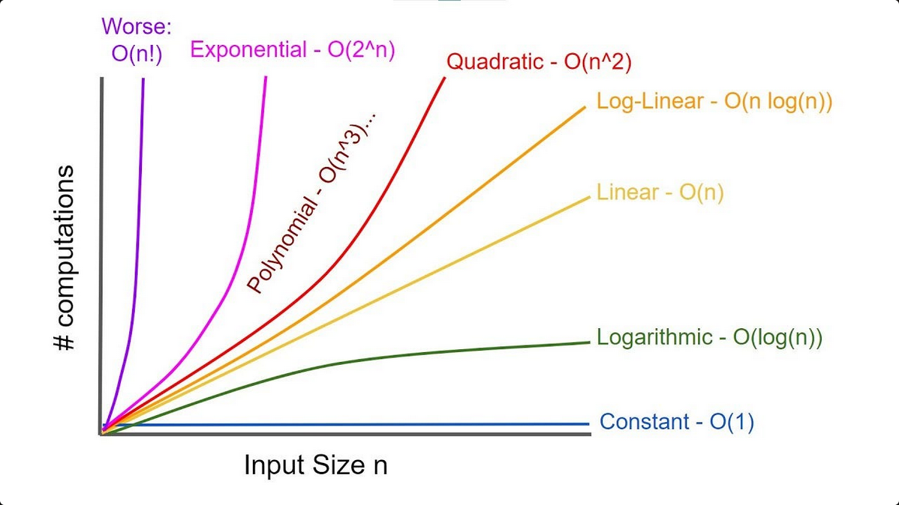

# Algorithms
Every crafts man needs a toolset. Consider this as my toolbox for software engineer. 

This is a list of all algorithms I've come in contact with and their respective use cases.


Yes, these resources are online that can access them instantly. \
But there is nothing more powerful than knowledge - and refreshing that knowledge via this long term (hobby) project is good asset in my algorithm toolbox.


## Steps To Solve Problems Using Algorithms
Problem solving is an art and there are various ways we can use to accomplish our end goal. The most efficient form of problem solving requires thoroughness. Here are seven steps we can apply:

1. Listen for clues
    > This can help identify what data structure or algorithm would be beneficial

2. Draw an example
    > Create two or three small test data samples and walk through the approach

3. Do a brute force algoritm.
    > Get a simple solution out there, don't worry about space/time complexity.

4. Optimize the algorithm on paper
    > Now focus on how you can improve the code.
    > You may optimize using [Optimize with B.U.D.](#optimize-with-bud)

5. Walk through the algorithm.

6. Write code.
    > Codify the algorithm

7. Verification.
    > Manually go through the code and double check and confirm that the result is accurate.


</br>
</br>

## Optimize With BUD

1. Bottleneck
    > Identify any bottleneck or problem areas in the code

2. Unecessary Work
    > Can you eliminate any unnecessary work

3. Duplicate Work
    > Find areas where you're being repetitive, then simplify it.

</br>
</br>
</br>
</br>


# BIG O - Space & Time Complexity



> Attempting to solve for: Big 3s O (Worst), Ω (Medium/Omega), and Θ (Best/Theta)

---
## How To Calulate Big O:
1. Identify the basic operations.
    > Determine which operations in your algorithm are the most time-consuming or occur most frequently

2. Count the operations. Count how many times these basic operations are performed in relation to the input size (n)

3. Find the dominant term: 
    > IF you have multiple term that grows the fastest as n increases. This is the typically the term with the highest degree.

4. Remove constants and coefficients:
    > Big O notion, we are intered in the growth rate, not the exact number of oeprations. So remove any contants or coefficients.

5. Simplify the expression and the result in a Big O format/notion.


## SAMPLE

<details>
<summary>Constant: O(1)=Ω(1)=O(1)</summary>

```java
//O(1) because this occurs once no runtime loop

public void constant(Array a) {
    println(a[1]);
}

```
</details>

<details>
<summary>Linear: O(n)=Ω(n)=O(n)</summary>

```java
function linear(Array a)
    for i = 1:length(a) {
        println(a[i])
    }
end

//1. Basic operation is print
//2. It is performed length(a) times
//3. There are no constants or coefficients to remove
//4. The simplified form is O(n)

```

</details>

<details>
<summary>Polynomial Time (Nested loops): O(n<sup>2</sup>) OR O(log(n))</summary>

```java
//Example to access 2D, 3D, 4D objects.
//This will take a long time. Try avoid if possible.
function access(a[][], size) 
    for i = 1:size
        for l = i:size
            println(a[i][l])
        end
    end 
end

```

</details>

<details>
    <summary>Exponential time: O(2<sup>n</sup>)</summary>

```java


```
</details>

<details>
    <summary>Quadratic time: O(n<sup>2</sup>)</summary>

```java


```
</details>

## Space vs Time Complexity
There is often a trade off between space and time complexity. Some algorithm use more space to achieve faster runtime, and vise versa.
---

**Recursion can provide you with the fastest (logarithm) solution or some of the slowest (exponential). Therefore the use case for this is impmortant.**
<details>
<summary>Exponential Time: O(n<sup>2</sup>)</summary>

```java
//Not good as you're calling the recusive function twice.
function exponential(val, n) 

    println(val)
    value += 1
    exponential(val, n-1)
    exponential(val, n-1) 
end

```
</details>


<details>
<summary>Logarithm Time: O(log(n)) </summary>

```java
// This is good case of recursion. 
// Each time you're spliting the problem into smaller problems.
function logarithm(Array a, String cutoff) 

    if length(a) < cutoff 
        return a
    end

    logarithm(a[1, length(a)/2], cutoff)
    logarithm(a[length(a)/2+1, length(a)-1], cutoff)
end

```
</details>


---
</br>
</br>

# Links
1. [Useful Trips/Tricks](./cool-tips.md)

# References

No I won't take all the credit for coming up with this list. As a result I will be posting all the references I've used.

+ [Algorithm Archive][algorithm-archive]

[algorithm-archive]: https://github.com/SolomonPerkins/algorithms/blob/master/README.md
