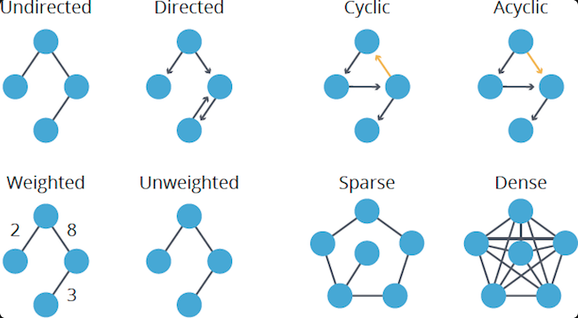

# Description


# Terminologies
1. Direction:
    > a. Directed

    > b. Undirected

2. Cycle:
    > a. Acyclic
    
    > b. Cyclic

3. Implementation may be done using any of the following to track/map relationships:
    > a. Adjacent list 
  
    > b. Adjacent Matrix

4. Use hashmap and sets to reduce going into a circle.

5. Graphs can have weighted edges
6. For searching/traversals: Breath-first vs Depth-first search or bi-directional breath first search
+ Bi-directional - use to find path quickly by searching on multiple edges/nodes.

# Pseudocode


# Use Cases
Listen for:
1. relationship between items (eg. Charles has a relationship with Mark)
2. There is a connection between items (eg. Situation "A" is related to "B", then "B" is equal C)

 

# Disadvantages
Look out for cycles and infinite loops.


# Code Snippet


<details>
<summary>Code Snippet</summary>

<p>

```go

func fn() {
  //Code here
}

```
</p>
</details>
