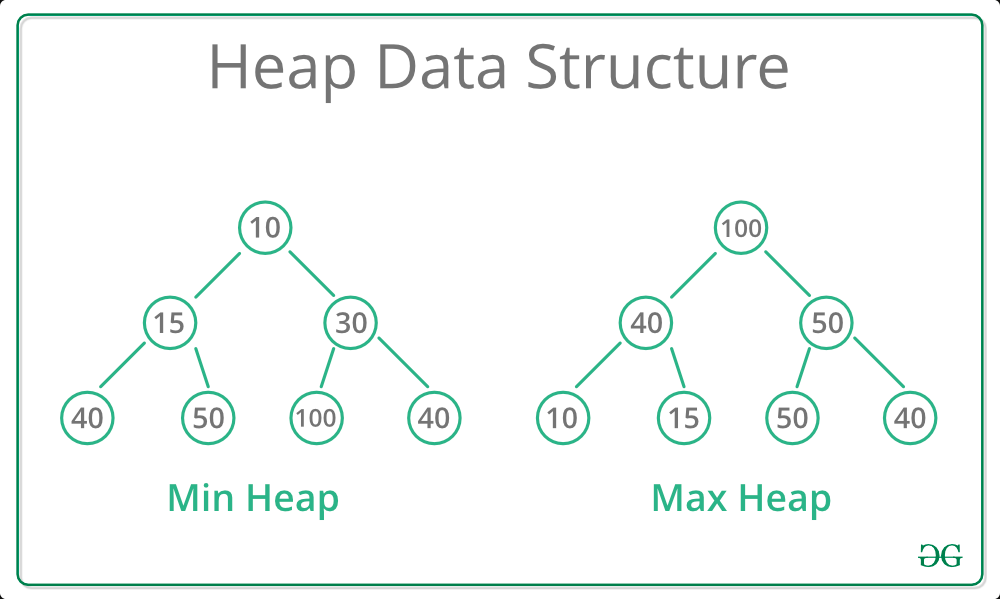

# Description
A priority queue is an abstract data type which allows you to insert or extract data with a priorty. 

Heap trees are always complete (meaning you need at least two left notes, not one).


# Pseudocode


# Use Cases
1. `Min heap` - Can be use to convert into a sorted array and vise-versa

## How To Optimize
1. Since the elements are in the correct order (top to bottom, left to right), we can collapse it down to an array and ensure the indecies are valid.
> This will help us to make sure we are space efficient

## Scenarios:

+ `Scenario 1`:
  + > Example details


# Disadvantages


# Code Snippet


<details>
<summary>Code Snippet</summary>

<p>

```go

func fn() {
  //Code here
}

```
</p>
</details>
