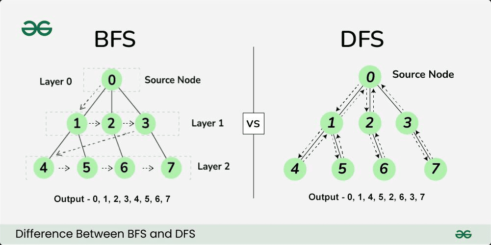

# Trees | Description
These are connected acyclical directed graphs.

**IMPORTANT: It is important  to know if a tree is balance or unbalanced as it affect runtime or space complexity.**


# Use Cases
1. Hirerachal data - useful when you have data within a said structure.
    > eg. folder structure.
2. Maybe they mention a tree


## BST - Binary Search Tree
This is an ordered tree with the `left-most` nodes are smaller than the `right` most nodes.
All right nodes are larger than the left nodes.


# Traversal
For example let us traverse this tree in the respective order.

             (10)
            /     \
          (5)      (15)
        /    \     /
     (3)     (8)  (11)
            /
          (7)

## In-Order
For BST this will result in the values be prented in ascending order from smallest to largest.
> This visit the nodes in order (if BST)
```
    in-order:
        go(left)
        visit(me)
        go(right)

```

<details>
    <summary>Pseudo Code: Syntax</summary>
    
    go(10)
        go(5)
            go(3)
            print(3)
        print(5)
        go(8)
            go(7)
            print(7)
        print (8)

    print(10)
        go(15)
            go(11)
            print (11)
        print (15)
    
    prints: 3 -> 5  -> 7 -> 8 -> 10 -> 11 -> 15
</details>


## Pre-Order
> Visits the nodes before recursing
```
    pre-order:
        visit(me)
        go(left)
        go(right)

```

##  Post-Order
> Visit the nodes  after recursing
```
    post-order:
        go(left)
        go(right)
        visit(me)
```


<details>
    <summary>Binary Search Tree Code</summary>

    ```java
    public class BinarySearchTree {
        public boolean search(int value) {
            if(root == null) 
                return false;
            else  
                return root.search(value);
        }
    }

    public class BSTNode {
        public boolean  search(int value) {
            if(value = this.value) 
                return true;
            else if (value < this.value>)
                if (left == null)
                    return false
                else
                    return left.search(value);
            else if(value > this.value)
                if(right == null)
                    return false;
                else
                    return right.search(value);
            
            return false;
        }
    }

    ```
</details>

## BFS (Breath First Search) vs DFS (Depth First Search)

    1. BFS uses a queue and ideal to find shortest path first. Uses more memory than DFS
    2. DFS uses a stack and uses less memory. Good for cyclical and topographical or graphs


## Algorithms To Perform Tree Balancing
1. AVL
2. Red/Black


## Tries | A Type of Tree
This is a type of tree and here are the details around it. 
> Used to find items such as valid words by performing different tries/scenarios.
> What you can do is to build a dictionary of all the prefixes we can use. Then check the scenarios against that prefix and keep trying until you found valid word.

`Use case: When you have string problem or words need solving.`

    (T)
        \
        (R)
       /
      (I)
        \
         (E)
        /
      (S)

Creating a dictionary similar to below then perform your actions on it to help evaluate if it there is an occurance.
| R | E | R |
|:-:|:-:|:-:|
| D | A | U |
| F | D | L |
| E | A | A |
| D | M | M |


