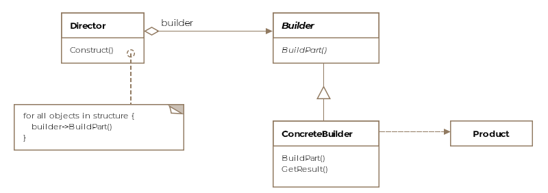

# Builder Design Pattern



This pattern is used to build objects. For complex objects made up of several sub-objects this helps to simplify and delegate the steps needed.

The builder pattern encapsulates or hides the process of building complex object and separate the constructions and representation.

## It Comprises Of:
- Builder: The interface/template used.
- Concrete Builder: The type of objects to be build
- Director: The class which controls how things are built.
- Product: The final output


`This is different from abstract pattern as it creates the object in segments, while the abstract factory pattern return the object in one go.`


<details>
<summary>Builder Pattern</summary>

```java
//The abstract class using all the default details

public abstract class AircraftBuilder {
    public void buildEngine() {}

    public void buildWings() {}

    public void buildCockpit() {}

    //Will not be overriden for all. Eg. F-22 fighter plains don't have bathrooms.
    public void buildBathrooms() {}


    abstract public IAircraft getResult();
}
```


```java
//Example of a builder implementation.
public class Boing747Builder extends AircraftBuilder{
    Boing747 boeing747;

    @Override
    public void buildCockpit() {

    }

    @Override
    public void buildWings() {}

    @Override 
    public void buildCockpit() {}

    @Override
    public void buildEngine() {}

    public IAircraft getResult() {
        return boeing747
    }
}

```


```java
//Example of a concrete class
public class F16Builder extends AircraftBuilder {
    F16 f16;

    @Override
    public void buildCockpit() {

    }

    @Override
    public void buildWings() {}

    @Override 
    public void buildCockpit() {}

    @Override
    public void buildEngine() {}

    public IAircraft getResult() {
        return f16;
    }
}
```


```java
//The Director class

public class Directory {
    AircraftBuilder aircraftBuilder;

    public Directory(AircraftBuilder aircraftBuilder) {
        this.aircraftBuilder = aircraftBuilder;
    }

    public vioud construct(bool isPassender) {
        aircraftBuilder.buildCockpit();
        aircraftBuilder.buildEngine();
        aircraftBuilder.buildWings();

        if(isPassenger) {
            aircraftBuilder.buildBathrooms();
        }
    }
}

```

```java
//The use case
public class Client {

    public void main() {
        F16Builder f16Builder = new F16Builder();
        Director director = new Director(f16Builder);
        director.construct(false)

        IAircraft f16 = f16builder.getResult();
    }
}

```
</details>
