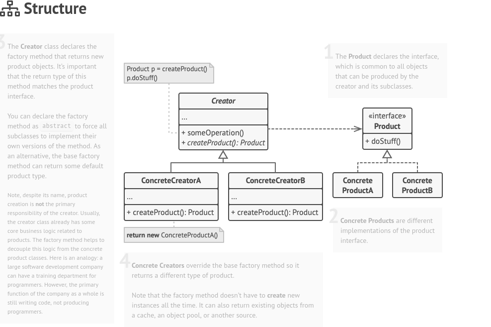

# Factory Method

[Factory Method](https://blog.miyozinc.com/wp-content/uploads/2016/06/factory-method-pattern-example.png)

A creational pattern use to create objects without the need to specify the exact class of the object you will be creating. `Delegating the instantiation logic of the child class.`.



## Implementation
- This uses a base abstract class to define the template
- Then extends the base class to handle different changes.
- Create a factory class which delegates the creation aspect.


## When To Use
- When you don't know all the types of objects/dependencies to create.


<details open>
<summary>Factory Method Pattern</summary>

```java
//The base class
public abstract class Wheel {
    public abstract float getDiameter();
    public abstract float getWidth();

    @Override
    public String toString() {
        return "//some details"
    }
}

```

```java
public class CarWheel extends Wheel {
    private float diameter;
    private float width;

    public CarWheel(float diameter, float width) {
        this.diameter = diameter;
        this.width = width;
    }


    @Override
    public float getDiameter() {
        return this.diameter;
    }

    @Override 
    public float getWidth() {
        return this.width
    }
}

```

```java
public class BikeWheel extends Wheel {
    private float diameter;
    private float width;

    public BikeWheel(float diameter, float width) {
        this.diameter = diameter;
        this.width = width;
    }

    @Override
    public float getDiameter() {
        return this.diameter;
    }

    @Override 
    public float getWidth() {
        return this.width
    }
}

```


```java
//The factory method

public class WheelFactory {
    static {
        Map<String, Wheel> wheels = new HashMap<String, Wheel>{

        }
    }

    public static Wheel getWheel(String type, float diameter, float width) {

        if("CarWheel".equalsIgnoreCase(type)) {
            return new CarWheel(diameter, width);
        }

        else if("BikeWheel".equalsIgnoreCase(type)) {
            return new BikeWheel(diameter, width);
        } 
    }
}
```


```java
public class TestFactory {
    public static void main() {
        Wheel carwheel = WheelFactory.getWheel("CarWheel", 15, 25);
        Wheel bikewheel = WheelFactory.getWheel("BikeWheel", 120, 1);
    }
}

```
</details>