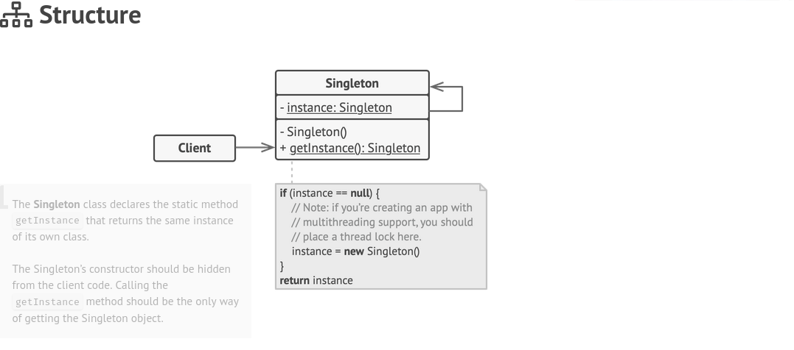

# Singleton


The purpose of this is to create only one instance of this object. With one global access point to that object.




There are three different implementations of singleton:

1. Eager Instantiation
    > This form creates a new instance of the class once the program starts. This can be very expensive and intensive

    <details open>
    <summary>Example</summary>

    ```java
    public class EagerSingleton {

        //Init at the start.
        private static EagerSingleton egar = new EagerSingleton();

        //Private constructor
        private EagerSingleton(){}

        public static EagerSingleton getInstance() {
            return egar
        }
    }

    ```

    </details>


2. Lazy Instantiation
    > Initialize only when needed. Useful to help maintain resource usage. There is a problem as with multi-thread machines two threads can call the methods exactly the same time and create multiple instances of the singleton.
    
    <details open>
    <summary>Lazy Init</summary>

    ```java
    
    public class LazySingleton {

        private static LazySingleton instance;

        //Private constructor
        private LazySingleton(){}

        public static LazySingleton getInstance() {
            //Only init the object if it doesn't exists.
            if(instance == null) {
                instance = new LazySingleton();
            }

            return instance
        }
    }

    ```

    </details>


3. Thread-safe Instantiation
   > This will ensure only one thread is able to accessed at any given time. Therefore protecting it from having multiple instances
    
    <details open>
    <summary>Thread Safe Example</summary>

    ```java
    public class Singleton {

        private static Singleton instance;

        //Private constructor
        private Singleton(){}

        public static Singleton getInstance() {
            //Only init the object if it doesn't exists.
            if(instance == null) {

                //Ensure the singleton is thread safe.
                synchronized  (Singleton.class) {
                    instance = new Singleton();
                }
            }

            return instance
        }
    }
    ```

    </details>


